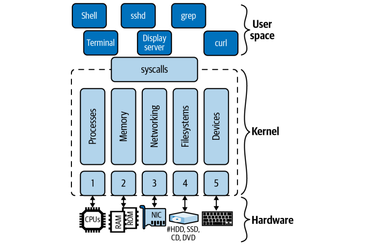

参考:https://www.youtube.com/watch?v=8YGNg38-6jM

# カーネルが無いシステムとは

カーネルが無いシステムとは、次のようなシステムをイメージすると良い。

> ハードウェアの上に、直接アプリが一つあるとき。

アプリからハードウェアにアクセスする構造だが、以下の点で不便

- アプリがバグっていたらシステム終了
- 最悪デバイスが二度と動かなくなる
- アプリを作るたびに直接ハードウェアを操作するプログラムを書かなければならない。
- 複数アプリで一つのデバイスをコントロールできない。
    - （仮想記憶）:複数のアプリを動かすときに隣のアプリを覗ける


つまり

**もしOSが存在せず、ハードウエア上にシステムを構築しなければならない場合、メモリ管理、割り込み処理、I/O デバイスとの通信、ファイル管理、ネットワークスタックの構成と管理など、やらなければならないことが大量に出てきてしまうのです。**


## なぜカーネルが必要なのか?

ハードウェアを操作する基本プログラムを作るため！
カーネルがあることでシステムを動かせる


# linuxのアーキテクチャの全体像



linuxkernelは次の三構造になっている。

- ハードウェア
    - CPU、メインメモリからディスクドライブ、ネットワークインターフェース、周辺機器まで
キーボードやモニターなどのデバイスを管理する。それぞれのハードウェアに対してインターフェースが用意されている。ハードウェアのインターフェースはさらに以下のように分類される。
1. CPU インターフェイス
2. メイン メモリとのインターフェイス
3. ネットワーク インターフェイスとドライバー (有線および無線。)
4. ファイルシステムおよびブロックデバイスドライバーインターフェイス
5. キャラクタデバイス、ハードウェア割り込み、およびデバイスドライバ（キーボード、端末など）

- カーネル
    - 多数のコンポーネントがあることに注意してください。init システムやメモリ管理、ネットワーキングにファイルシステムなどカーネルとユーザー ランドの間にあるもの。
    ユーザーランドからは**システムコール**経由で呼び出される。
    - ex
        - `write`システムコール
        - `getuid`システムコール

- ユーザーランド
    - オペレーティング システム コンポーネントを含む、大部分のアプリが実行されている場所。シェル (第 3 章で説明)、ps や ssh などのユーティリティ、グラフィカル ユーザーなど、ユーザーから目に見える場所は**ユーザーランド**に属します。
    - ex
        - `ps`コマンド
        - `ssh`コマンド
        - `grep`コマンド

ここまででわかる通り、私たちが通常 Linux の動作の一部と考えているシェルや`grep`、`find`、`ping`などのユーティリティなどのシステムは厳密に言えればカーネルの機能の一部ですが、ダウンロードするアプリと非常によく似ており、linuxの中でもユーザーランドの一部です。

そのほかのユーザーランドとカーネルのトピックでは、`ユーザーモード`と`カーネルモード`という言葉がよくつかわれます。
これはLinuxのハードウェアに対する特権のことであり、平たく言うと**カーネルモードでシステムが動いている場合にはハードウェアの利用が可能である**ということになります。


# カーネルコンポーネント

まず初めに、Linuxカーネルはモノシリックなものです。
すべてのコンポーネントは単一のバイナリに含まれています。

ですがコードのレベルでは機能ごとに分けられており、責任範囲も明確になってます。
各コンポーネントは次の通りです。

- プロセス管理：実行ファイルに基づくプロセスの起動
- メモリ管理  ：プロセスのメモリ割り当てやファイルをメモリにマップすることなど
- ネットワーク：ネットワークインターフェースの管理、ネットワークスタックの提供など
- ファイルシステム：ファイル管理、ファイルの作成と削除
- デバイス　　：デバイスの管理

各コンポーネントは相互に依存していることもあります。
それぞれ簡単に説明します。


## プロセス管理

カーネルにはプロセスを管理するための機能がたくさんあります。
割り込みなどCPUアーキテクチャにこゆうのものもあれば、プログラムの起動やスケジューリングに特化したものもあります。
複雑な親子関係だと、以下のような図になります。


- セッションSID(ttyあり,なし)
    - プロセスグループPID
        - プロセス1
            - スレッド
        - プロセス2
            - スレッド1
            - スレッド2


### セッションSID

複数のプロセスグループを含み、高度なユーザー向けユニットを提供する。
tty端末を持つものと、バックグラウンド実行されるものがある。
単位はセッションＩＤ（SID）と呼ぶ

### プロセスグループPGID

複数のプロセスをまとめて管理するグループがプロセスグループ。
一つのセッションには一つ以上のプロセスグループが存在する。


### プロセスPID

一般的にプロセスとは実行プログラム（バイナリ）に対応してます。
プログラムの実行に必要なものをグループ化したものです。

### スレッド

一般的にプロセスとは実行プログラム（バイナリ）に対応してます。
一方、スレッドとはプロセス内のコードを実行する単位です。
つまり、

- プロセス
    - スレッド

という親子関係が成り立ちます。
プログラミングにおいてマルチスレッド技術を使うことで、複数のＣＰＵで複数のスレッドが並列実行されることもあります。
つまり、

- プロセス
    - スレッド（in CPU1）
    - スレッド（in CPU2）

という親子関係が成り立ちます。

ところがカーネル内での実態は、**プロセスの親子関係**で成り立っており、
スレッド=プロセスとなっている。


## メモリ管理

仮想メモリはシステムに搭載されている物理メモリサイズ以上のメモリを持っているかのように見せかける機能です。
物理メモリと仮想メモリの両方には、**ページ**と呼ばれる4kbの固定幅に分割されています。


上記の図の中央にある物理メモリのPPN4ではプロセスXとプロセスYの双方がアクセスしています。
これが意味するところとは、各プロセスが同じ物理ページを参照することもあり得るということです。
これにより物理メモリを有効に活用することができます。

### CPUに内蔵されているTBL

CPUはプロセスが仮想ページにアクセスするたびに、その仮想アドレスに対応する物理アドレスに変換する作業が発生します。

この作業を後押しするために、各CPUファミリア（AMD、x86など）は**Translation Lookaside Buffer、TLB**と呼ばれるチップ上の検索を実装しています。このCPU
内部にあるキャッシュにより、高速アクセスが実現されています。


### CPUの情報を確認してみる

RAMの空き容量を確認するには、`/proc/meminfo`を確認します。
純粋なcatコマンドだけでも大量の情報が出力されると思います。

```sh
[root@d74ed5791dfa myworking]# cat /proc/meminfo
MemTotal:        8001864 kB
MemFree:         4803932 kB
MemAvailable:    6764496 kB
Buffers:          177200 kB
Cached:          1974496 kB
SwapCached:            0 kB
Active:           732236 kB
Inactive:        2016892 kB
Active(anon):       3312 kB
Inactive(anon):   598200 kB
Active(file):     728924 kB
Inactive(file):  1418692 kB
Unevictable:           0 kB
Mlocked:               0 kB
SwapTotal:       2097152 kB
SwapFree:        2097152 kB
Dirty:                 4 kB
Writeback:             0 kB
AnonPages:        573460 kB
Mapped:           346068 kB
Shmem:              4064 kB
KReclaimable:      57452 kB
Slab:             142644 kB
SReclaimable:      57452 kB
SUnreclaim:        85192 kB
KernelStack:       14912 kB
PageTables:         8180 kB
NFS_Unstable:          0 kB
Bounce:                0 kB
WritebackTmp:          0 kB
CommitLimit:     6098084 kB
Committed_AS:    3745712 kB
VmallocTotal:   34359738367 kB
VmallocUsed:       36500 kB
VmallocChunk:          0 kB
Percpu:            11232 kB
AnonHugePages:    284672 kB
ShmemHugePages:        0 kB
ShmemPmdMapped:        0 kB
FileHugePages:         0 kB
FilePmdMapped:         0 kB
HugePages_Total:       0
HugePages_Free:        0
HugePages_Rsvd:        0
HugePages_Surp:        0
Hugepagesize:       2048 kB
Hugetlb:               0 kB
DirectMap4k:       41984 kB
DirectMap2M:     6115328 kB
DirectMap1G:    10485760 kB
```

これらの情報から必要な情報を抜き取るには`grep`を併用して活用することをお勧めします。

- 例えば物理メモリのサイズを確認するには`MemTotal`の項目を参照します。

```sh
grep MemTotal /proc/meminfo
```

実行結果

```sh
[root@d74ed5791dfa myworking]# grep MemTotal /proc/meminfo
MemTotal:        8001864 kB
```

- さらに、仮想メモリのサイズを確認するには`VmallocTotal`項目を参照します。

```sh
grep VmallocTotal /proc/meminfo
```

実行結果... 仮想メモリは物理メモリ以上のメモリを持っているように見せる機能ですから`MemTotal`よりもサイズが大きくなりますね

```sh
[root@d74ed5791dfa myworking]# grep VmallocTotal /proc/meminfo
VmallocTotal:   34359738367 kB
```


## ネットワーク

linuxのネットワークスタックは、階層化されたアーキテクチャに従っています。

- ソケット
    - 通信が抽象化されたもの。プログラミングレベル。
- TCPとUDP
    - 通信方式
- インターネットプロトコル（IP）
    - アドレスに基づいたマシン間の通信

カーネルで実装しているのは上記の3つのみで、HTTPやSSHはユーザー空間で実装されています。


## ファイルシステム

linuxでは、ハードディスクドライブやSSDなど記憶装置の上に、ファイルシステムを構築する機能を提供しています。
ファイルシステムには様々な種類があり、それぞれ特色があります。一般的なファイルシステムはext4やbtrfs、ntfsなどがあります。

そのような異なるファイルシステムを束ね上げるのが`VFS`というシステムです。（正式名は`Virtual File System`）
`VFS`自体はカーネル空間に存在しますが、`open`,`close`,`read`,`write`などのシステムコールを実装しています。

逆に、それぞれのファイルシステムに対してはプラグイン方式で対応しています。


## デバイスドライバ

デバイスドライバはデバイスを操作するためのソースコードです。
以下のようなデバイスが捜査対象です。

- キーボード、マウス、ハードディスクドライブとの相互やり取り
- `/dev/pts/`に存在する疑似端末デバイス
- GPU

使用されているデバイスの一覧を確認するためには、`mount`コマンドを使用します。

```sh
[root@d74ed5791dfa myworking]# mount
overlay on / type overlay (rw,relatime,lowerdir=/var/lib/docker/overlay2/l/KUED77NDQ2VIQTJKHDT5TVRC5B:/var/lib/docker/overlay2/l/DZNLNSZ3BXFZ63TB7EX3JKG3EI:/var/lib/docker/overlay2/l/LDNSRHZRYB7BTYXMDCJG3LRJ32:/var/lib/docker/overlay2/l/JEXPX24JSJU76REMP4XZ3SKVDS:/var/lib/docker/overlay2/l/CPFYGJFOVIE44MY5KDAGA33JJ4:/var/lib/docker/overlay2/l/JHDDCWFSOB3FJTRF2SFFOKKODU:/var/lib/docker/overlay2/l/BMAMETRRYZNT7H44UOZZ4GGSCC:/var/lib/docker/overlay2/l/MFFC47CV7ETMJVVD7SNOKJIUHS:/var/lib/docker/overlay2/l/OZRFZXZVVLZCOMLNXXFN6JHYFB:/var/lib/docker/overlay2/l/SL4UY27Q534ZVGOYM7FVHHIKQV:/var/lib/docker/overlay2/l/AYMQ2IGLJ7UEEU5X2IANCMKPW5:/var/lib/docker/overlay2/l/25Q3HMNBKBTRQC47PAJQA4UGGD:/var/lib/docker/overlay2/l/S22JWTQ25OY7KMS62CUNCAQ5QN:/var/lib/docker/overlay2/l/IXXE4DRTUBXWZ6WPBNFADJM72E:/var/lib/docker/overlay2/l/OZBA3SQBWAE2BVYOD6OOFFUEBL:/var/lib/docker/overlay2/l/KQYGBFR6WR3O6UYLRTM4HQ26UV:/var/lib/docker/overlay2/l/JVZ4MBIY2PDCJECPML4OUJVZNE:/var/lib/docker/overlay2/l/EWYNXR5C5DNQD3KHKK2BJE3B6X:/var/lib/docker/overlay2/l/BU5STOQYPN4P3LPJWUC3AH44C6,upperdir=/var/lib/docker/overlay2/27de62f94edab7010c56cfb84a58d865eea424d8b70d794e9b5a45d5483a407a/diff,workdir=/var/lib/docker/overlay2/27de62f94edab7010c56cfb84a58d865eea424d8b70d794e9b5a45d5483a407a/work)
proc on /proc type proc (rw,nosuid,nodev,noexec,relatime)
tmpfs on /dev type tmpfs (rw,nosuid,size=65536k,mode=755)
devpts on /dev/pts type devpts (rw,nosuid,noexec,relatime,gid=5,mode=620,ptmxmode=666)
sysfs on /sys type sysfs (ro,nosuid,nodev,noexec,relatime)
tmpfs on /sys/fs/cgroup type tmpfs (rw,nosuid,nodev,noexec,relatime,mode=755)
cpuset on /sys/fs/cgroup/cpuset type cgroup (ro,nosuid,nodev,noexec,relatime,cpuset)
cpu on /sys/fs/cgroup/cpu type cgroup (ro,nosuid,nodev,noexec,relatime,cpu)
cpuacct on /sys/fs/cgroup/cpuacct type cgroup (ro,nosuid,nodev,noexec,relatime,cpuacct)
blkio on /sys/fs/cgroup/blkio type cgroup (ro,nosuid,nodev,noexec,relatime,blkio)
memory on /sys/fs/cgroup/memory type cgroup (ro,nosuid,nodev,noexec,relatime,memory)
devices on /sys/fs/cgroup/devices type cgroup (ro,nosuid,nodev,noexec,relatime,devices)
freezer on /sys/fs/cgroup/freezer type cgroup (ro,nosuid,nodev,noexec,relatime,freezer)
net_cls on /sys/fs/cgroup/net_cls type cgroup (ro,nosuid,nodev,noexec,relatime,net_cls)
perf_event on /sys/fs/cgroup/perf_event type cgroup (ro,nosuid,nodev,noexec,relatime,perf_event)
net_prio on /sys/fs/cgroup/net_prio type cgroup (ro,nosuid,nodev,noexec,relatime,net_prio)
hugetlb on /sys/fs/cgroup/hugetlb type cgroup (ro,nosuid,nodev,noexec,relatime,hugetlb)
pids on /sys/fs/cgroup/pids type cgroup (ro,nosuid,nodev,noexec,relatime,pids)
rdma on /sys/fs/cgroup/rdma type cgroup (ro,nosuid,nodev,noexec,relatime,rdma)
misc on /sys/fs/cgroup/misc type cgroup (ro,nosuid,nodev,noexec,relatime,misc)
cgroup on /sys/fs/cgroup/systemd type cgroup (ro,nosuid,nodev,noexec,relatime,name=systemd)
mqueue on /dev/mqueue type mqueue (rw,nosuid,nodev,noexec,relatime)
shm on /dev/shm type tmpfs (rw,nosuid,nodev,noexec,relatime,size=65536k)
drvfs on /myworking type 9p (rw,noatime,dirsync,aname=drvfs;path=C:\;uid=0;gid=0;metadata;symlinkroot=/mnt/host/,mmap,access=client,msize=262144,trans=virtio)
drvfs on /root type 9p (rw,noatime,dirsync,aname=drvfs;path=C:\;uid=0;gid=0;metadata;symlinkroot=/mnt/host/,mmap,access=client,msize=262144,trans=virtio)
/dev/sdd on /etc/resolv.conf type ext4 (rw,relatime,discard,errors=remount-ro,data=ordered)
/dev/sdd on /etc/hostname type ext4 (rw,relatime,discard,errors=remount-ro,data=ordered)
/dev/sdd on /etc/hosts type ext4 (rw,relatime,discard,errors=remount-ro,data=ordered)
devpts on /dev/console type devpts (rw,nosuid,noexec,relatime,gid=5,mode=620,ptmxmode=666)
proc on /proc/bus type proc (ro,nosuid,nodev,noexec,relatime)
proc on /proc/fs type proc (ro,nosuid,nodev,noexec,relatime)
proc on /proc/irq type proc (ro,nosuid,nodev,noexec,relatime)
proc on /proc/sys type proc (ro,nosuid,nodev,noexec,relatime)
tmpfs on /proc/acpi type tmpfs (ro,relatime)
tmpfs on /proc/kcore type tmpfs (rw,nosuid,size=65536k,mode=755)
tmpfs on /proc/keys type tmpfs (rw,nosuid,size=65536k,mode=755)
tmpfs on /proc/timer_list type tmpfs (rw,nosuid,si
```


# システムコールとは

アプリがカーネルの機能を呼び出すこと。
linuxkernelにはAPIが存在しており、このAPIを利用することでシステムコールが可能です。
Go、Rust、Python、Java などの言語は、これらの syscall 上に構築される可能性があります。


## システムコール一覧

- プロセス関連
    - `clone` : 
    - `fork`
    - `execve`
    - `getpid`
    - `setuid`
    - `setns`
    - `getrusage`
    - `capset`
    - `ptrace`
- メモリ管理
    - `brk`
    - `mmap`
    - `munmap`
    - `mremap`
    - `mlock`
    - `mincore`
- ネットワーク関連
    - `socket` : ソケット(socket)と呼ばれる通信の端点を作り出します。
    - `setsockeopt` : ソケット番号を指定して通信方式を設定する
    - `bind` : ソケットにポート番号を付与する。
    - `listen` : 外部からのコネクションを待機するためにソケットをリッスン状態にする。
- ファイルシステム
    - `open` : 読み書きするためにファイルを開く。
    - `read` : ファイルディスクリプタからファイルを開く。
    - `write` : ファイルへ情報を書き込む。
- 時間
    - `time`
    - `clock_settime`


### 具体例1:writeシステムコール

> 具定例）write()システムコール

このコードはデータを書き込む。`man 2 write`参照

かの有名な`echo`コマンドで使用される。

#### 具体例2:getuidシステムコール

getuidは現在ログインしているユーザーの一意のIDを手にれることができる。
linuxのmanページから`getuid`を確認することでオフィシャルな説明が確認可能だ。

> getuid() returns the real user ID of the calling process.

ちなみに似たコマンドで`fgeteuid`が存在する。

> getuid () は呼び出しプロセスの実際のユーザー ID を返します。
> 
> geteuid () は、呼び出しプロセスの実効ユーザー ID を返します

from https://www.man7.org/linux/man-pages/man2/getuid.2.html

**そして、この`getuid`はシステムコールとしてlinuxkernelのapiとして実装されている。**

この`getuid`をlinuxコマンドラインから呼び出すには次のように`id`コマンドを使用する。

```sh
id --user
```


### システムコールを目視する

`strace`コマンドを使用。このコマンドはプロセスのシステムコールの履歴を見ることができる。
プログラミングの`hello world`を見てみよう。

#### C言語

- C言語で書かれたコードをコンパイルした`hello_c`を実行する際

```sh
strace -o c.log ./hello_c
```

#### Python

- pytonで書かれたコードを実行する際

具体例

```python
#!/usr/bin/python3
print("hello python")
```

このコードのシステムコールを見てみる。

```sh
strace -o c.log  ./hello.py
```


実行結果...

```
read(3, "#!/usr/bin/python3", 18)       = 18
read(3, "\nprint(\"hello world\")\n", 4096) = 22
close(3)                                = 0
stat("./hello.py", {st_mode=S_IFREG|0755, st_size=40, ...}) = 0
readlink("./hello.py", 0x7ffe79b13de0, 4096) = -1 EINVAL (Invalid argument)
getcwd("/home/minegishiminami/myworking/0000dev", 4096) = 40
lstat("/home/minegishiminami/myworking/0000dev/hello.py", {st_mode=S_IFREG|0755, st_size=40, ...}) = 0
openat(AT_FDCWD, "./hello.py", O_RDONLY) = 3
fcntl(3, F_GETFD)                       = 0
fcntl(3, F_SETFD, FD_CLOEXEC)           = 0
fstat(3, {st_mode=S_IFREG|0755, st_size=40, ...}) = 0
ioctl(3, TCGETS, 0x7ffe79b24d60)        = -1 ENOTTY (Inappropriate ioctl for device)
lseek(3, 0, SEEK_CUR)                   = 0
fstat(3, {st_mode=S_IFREG|0755, st_size=40, ...}) = 0
read(3, "#!/usr/bin/python3\nprint(\"hello "..., 4096) = 40
lseek(3, 0, SEEK_SET)                   = 0
read(3, "#!/usr/bin/python3\nprint(\"hello "..., 4096) = 40
read(3, "", 4096)                       = 0
close(3)                                = 0
write(1, "hello world\n", 12)           = 12
rt_sigaction(SIGINT, {sa_handler=SIG_DFL, sa_mask=[], sa_flags=SA_RESTORER, sa_restorer=0x7f5d96112f10}, {sa_handler=0x630520, sa_mask=[], sa_flags=SA_RESTORER, sa_restorer=0x7f5d96112f10}, 8) = 0
brk(0xe94000)                           = 0xe94000
sigaltstack(NULL, {ss_sp=0xdd8870, ss_flags=0, ss_size=8192}) = 0
sigaltstack({ss_sp=NULL, ss_flags=SS_DISABLE, ss_size=0}, NULL) = 0
exit_group(0)                           = ?
```

まず注目するべきは一行目。

> read(3, "#!/usr/bin/python3", 18)       = 18
> read(3, "\nprint(\"hello world\")\n", 4096) = 22

pythonはインタプリタ言語であるため、まず最初に読み込みを行っている。

次に`write`が書かれているコード。

> write(1, "hello world\n", 12)           = 12

この部分ではデータを書き込む`write`システムコールが行われている。


### 結論

どんなプログラミング言語であれ、`hello world`を出力するときは

**`write`システムコールを行っている**

ことがわかると思います。


## CPUモード

カーネルのCPUを動かすときのモード。大きく二種類ある。
(x86_64のring protection)
ご覧のとおり、私たちが通常 Linux の動作の一部と考えているものの多くは、
シェルや grep、find、ping などのユーティリティなどのシステムは、実際には
カーネルですが、ダウンロードするアプリと非常によく似ており、ユーザーランドの一部です
- カーネルモード:全命令を実行できる。カーネルの実行中はカーネルモードになる。
- ユーザーモード:一部命令が禁止される。アプリを実行するときにはユーザーモードになる。
    - ハードウェアアクセスを禁止
    - 禁止されたシステムコールをすると特定の処理が動く


## カーネルの拡張

### カーネルモジュール

linuxに存在するカーネルモジュールは、カーネルの再コンパイルなしにカーネルに組み込めるプログラムです。

カーネルモジュールは次のディレクトリ配下に存在します。

```sh
ls /lib/modules/
```

ディレクトリ配下には大量の`.ko`ファイルが格納されています。
これは、linux kernel module formatに関連付けられている拡張子です。

ちなみに、現在どのモジュールがロードされているかを確認するためには`lsmod`を使用します。

```sh
lsmod
```


### eBPF

カーネルの機能を拡張する方法は`eBPF`という物があります。
これは、linuxkernelの`bpf`システムコールを用いてlinuxkernelの機能を効率的に拡張できます。

eBPFはカスタム64bitRISC命令(cpuファミリアの一種でRISCがあったことを思い出してください。)を用いて、カーネル内の仮想マシンとして実装できます。


#### eBPFの使用例

- cilium(kubernetisにおけるserviceMeshは、サービス同士の通信が大量に発生する。CiliumはアプローチとしてKernel Spaceにてパケットフィルタの処理が行えるeBPFを使ってiptableを置き換えることで高速な通信を実現している。)
- iovisor
- CNCF Falco
- L4 katran


from https://qiita.com/sg-matsumoto/items/8194320db32d4d8f7a16

```python
#!/usr/bin/python3

from bcc import BPF

bpf_text = """
int trace_sys_clone(struct pt_regs *ctx) {
  bpf_trace_printk("Hello, World!\\n");
  return 0;
}
"""

b = BPF(text=bpf_text)
b.attach_kprobe(event="__x64_sys_clone", fn_name="trace_sys_clone")

b.trace_print()
```


