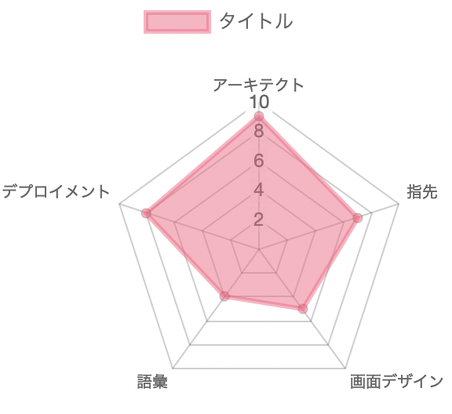
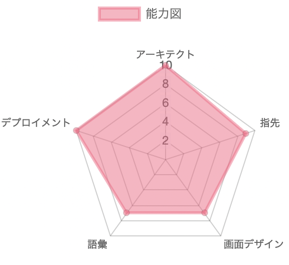

## 私は誰か

ニックネーム：みねぎしれい

アーキテクト,デプロイメント力によるシステム構築を指力で高速化し、画面デザイン知識と語彙力により余す事なく表現する。

を目標とするwebエンジニア。

## 何ができるのか？

- アーキテクト
- デプロイメント
- 指力
- 語彙力
- 画面デザイン

## 現時点での実力

- アーキテクト(9)
- デプロイメント(8)
- 指力(7)
- 語彙力(5)
- 画面デザイン(5)

## 現時点でのレーダーチャート

  

## ありたい姿のレーダーチャート

  

## 能力一覧

### アーキテクト

- docker
- アーキテクチャパターン

### デプロイメント

- python
- django
- js

### 指先

- powershell
- sck
- 指先トレーニング

### 語彙

適切なキーワード選択と強調ポイントが明確になる。

- 見出し
- 「骨のあるキーワード」
- ブログ作成

### 画面デザイン

- デザインコツ一覧
- webデザイン

## 現在取り組んでいること

1. docker,アーキテクチャパターンの習得と記事化(語彙力,デザイン,アーキテクチャ)

2. 指先トレーニング(指力)

3. SNSによるブランディング(語彙力)

## 最近かっこいいと思ったツイート

<blockquote class="twitter-tweet">
ヘルプデスク10年間は流石にやり過ぎ。 もう、近づくだけでパソコン治る時あるんだけど🤔
&mdash; 鯛焼き@ダム巡り情シス/(はまちゃん) (@taiyaki_net) <a href="https://twitter.com/taiyaki_net/status/1541716984081285121?ref_src=twsrc%5Etfw">June 28, 2022</a></blockquote> 

## 備考

title:社内SE雑記ブロ -この記事を書いている人について-

description:自己紹介です。

img:https://pbs.twimg.com/profile_images/1532491264746467328/86SxTPKV_400x400.jpg

